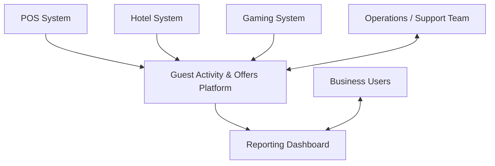
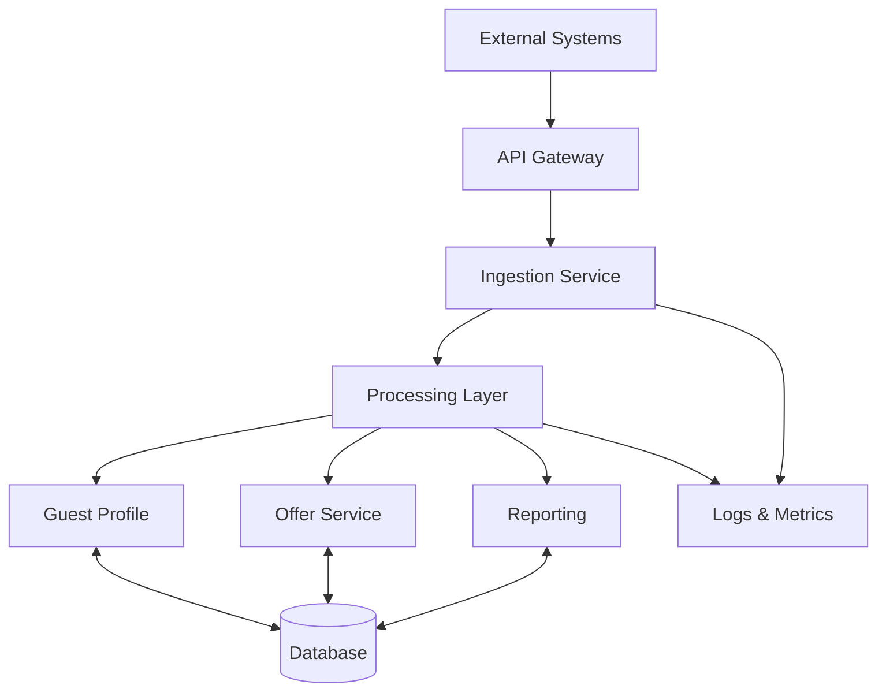
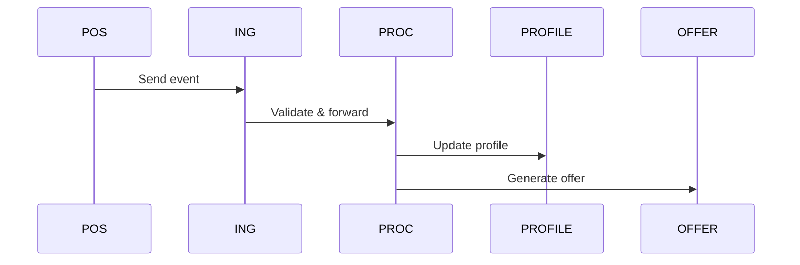
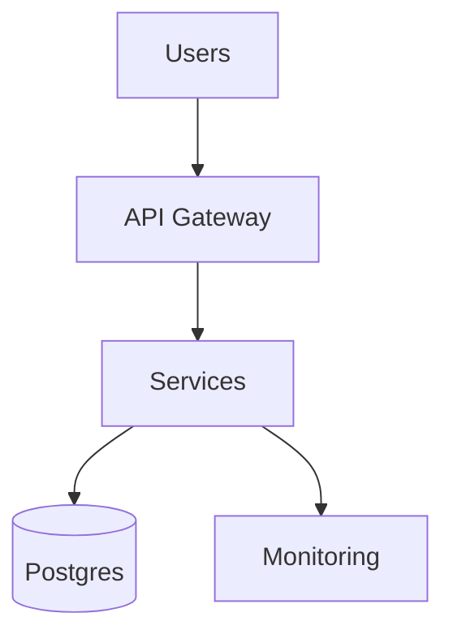

# Architecture Walkthrough

## 1. Context Diagram

```mermaid
flowchart TB
    pos[POS System]
    hotel[Hotel System]
    gaming[Gaming System]
    platform[Guest Activity & Offers Platform]
    dashboard[Reporting Dashboard]
    users[Business Users]
    ops[Operations / Support Team]

    pos --> platform
    hotel --> platform
    gaming --> platform
    platform --> dashboard
    users <--> dashboard
    ops <--> platform
```

## 2. Logical Architecture

```mermaid
flowchart TB
    ext[External Systems]
    api[API Gateway]
    ingest[Ingestion Service]
    process[Processing Layer]
    profile[Guest Profile]
    offer[Offer Service]
    reporting[Reporting]
    db[(Database)]
    obs[Logs & Metrics]

    ext --> api --> ingest --> process
    process --> profile
    process --> offer
    process --> reporting
    profile <--> db
    offer <--> db
    reporting <--> db
    ingest --> obs
    process --> obs
```

## 3. Integration Flow

```mermaid
sequenceDiagram
    participant POS
    participant ING
    participant PROC
    participant PROFILE
    participant OFFER

    POS->>ING: Send event
    ING->>PROC: Validate & forward
    PROC->>PROFILE: Update profile
    PROC->>OFFER: Generate offer
```

## 4. Deployment

```mermaid
flowchart TB
    user[Users]
    api[API Gateway]
    svc[Services]
    db[(Postgres)]
    prom[Monitoring]

    user --> api --> svc --> db
    svc --> prom
```